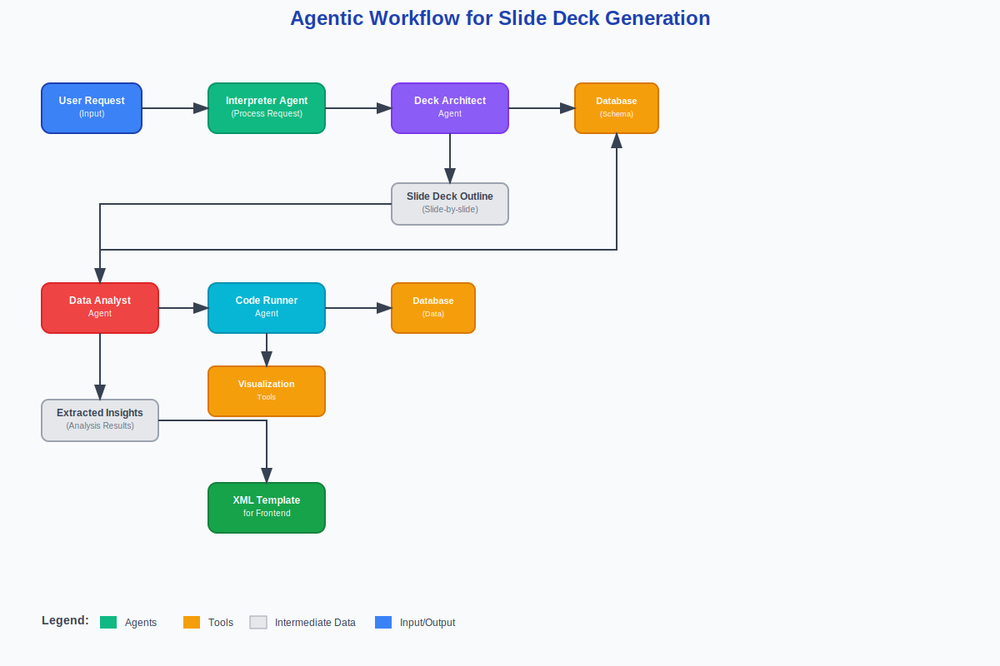

# Decks&Data

# Description

Decks&Data is a generative slide deck tool powered by a multi-agent system that transforms structured data into customized, audience-specific presentations.

Consultants, founders and executives present insights to various audiences like employees, shareholders, investors and the media. Even while working with familiar data, time is lost finding the right numbers and figuring out how to present them, which shifts the focus away from what actually matters: the message.

Built on an ADK-powered architecture, the system uses a complex orchestration workflow to coordinate four specialized agents: an interpreter, a deck architect, a data analyst and an art director. Through A2A communication, the agents interpret natural language prompts, query multi-table datasets, analyze results, and generate slides with tailored charts and text.

The result is clear, persuasive storytelling adapted to the goals, values, and knowledge level of each audience. The system demonstrates agentic reasoning, natural language understanding, dynamic A2A coordination, scalable orchestration, and audience-aware insight generation.

## Key Features

- Initial setup for data sources, audience selection, and presentation goals
- Automatic presentation structure creation
- AI-powered slide content generation
- Data visualization and insights generation
- Performance metrics and analytics

## Tech Stack

- **Backend**: FastAPI + Google ADK + PostgreSQL + Redis
- **Frontend**: React + TypeScript + Vite
- **Visualization**: D3.js
- **Styling**: Shadcn components + Tailwind CSS
- **Real-time**: Server-Sent Events (SSE)

## Architecture

The system consists of:

1. **Interpreter Agent** - Translates the user request into a well defined problem and provides additional context
2. **Deck Architect Agent** - Generates presentation outlines and structure
3. **Data Analyst Agent** - Analyses the data and generates slide content based on the insights
5. **Code Runner Agent** - Runs the queries requested by the Data Analytics Agent
4. **Visualization Agent/Tool** - Produces charts and graphics based on the provided data and instructions

### Agentic Workflow

### Schemas

Backend and frontend communication is based on xml format. The schemas are available in `schemas/`:
- `slide_ideas.xsd` - output schema for the deck architect
- `slide_schema.xsd` - output schema for the Analytics agent containing the slide contents

## Installation

Development setup:

1. Set up `GOOGLE_API_KEY` in the `.env` file.
2. Run `docker compose up -d --build` to begin backend development
3. Install `node` and `pnpm` and run `pnpm run dev` to launch frontend

